# MPBR Calculator

An Android app that computes Maximum Point Blank Range (MPBR), modeled after
shooterscalculator.com's MPBR tool. Uses a point-mass exterior ballistics
simulator with G1 or G7 drag, and supports altitude / temperature / humidity
atmospheric corrections and full-value crosswind drift.

Includes 329 factory ammo presets organized into color-coded categories
(rifle, rimfire, pistol, shotgun) with a configurable trajectory table (50 yd
steps, default 50–500 yd, max 2,000 yd). DOPE charts can be saved as a JPEG
to your gallery, optionally with a scope reticle illustration showing
color-coded holdover callouts — positioned at the bullet's actual 2D location
on the reticle (elevation + crosswind drift) for every range that fits within
the reticle's extent.

## Screenshots

<table>
<tr>
<td align="center"><br><em>Main input screen (M80 preset)</em></td>
<td align="center"><br><em>Ammo preset dropdown (rimfire section)</em></td>
<td align="center"><br><em>Reticle preset dropdown by manufacturer</em></td>
</tr>
<tr>
<td align="center"><br><em>SFP reticle selected with Current Magnification field (set to 6× on a 12×-calibrated scope)</em></td>
<td align="center"><br><em>Atmosphere and trajectory table settings</em></td>
<td align="center"><br><em>Results: holdover dots rescaled for 6× (half the reticle's 12× calibration), labeled "@ 6×" above the scope circle</em></td>
</tr>
<tr>
<td align="center"><br><em>Trajectory table and Save DOPE Chart</em></td>
<td align="center">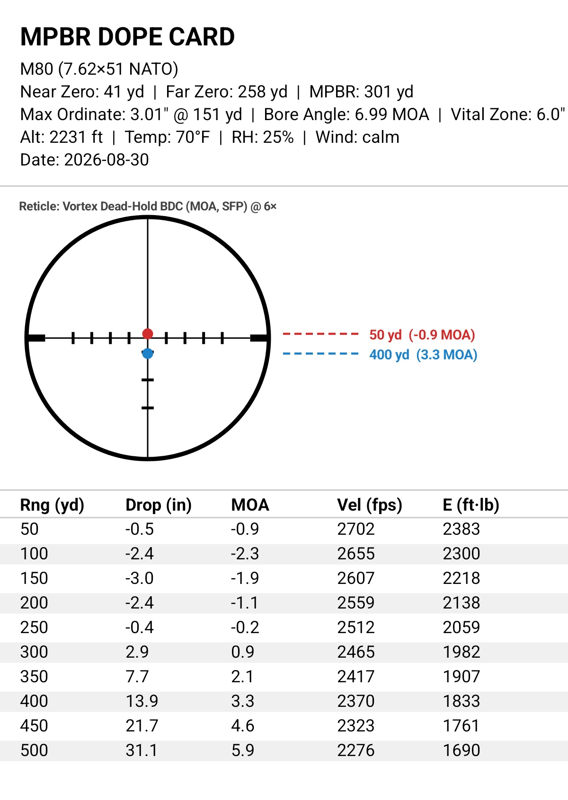<br><em>Exported DOPE chart JPEG</em></td>
<td></td>
</tr>
</table>

## Opening in Android Studio

1. Unzip the project somewhere on your machine.
2. In Android Studio: **File → Open** → pick the `MpbrApp` folder (the one
   containing `settings.gradle.kts`).
3. Android Studio will sync Gradle and download dependencies. First sync
   takes a few minutes.
4. If prompted about a missing Android SDK, accept the offer to install it.
5. Click ▶️ Run.

Tested with Android Studio Meerkat (2024.3) or later. Builds against Android
SDK 37, supports devices from Android 7 (API 24) up.

Build toolchain: Kotlin 2.2.10 · AGP 9.3.2 · Gradle 9.5.0. The Kotlin
Compose compiler plugin (`org.jetbrains.kotlin.plugin.compose`) is now
separate from the Kotlin plugin — required since Kotlin 2.x.

## What's where

```
MpbrApp/
├── settings.gradle.kts          ← root project config
├── build.gradle.kts             ← top-level plugin versions
├── gradle.properties
├── gradle/wrapper/              ← Gradle wrapper jar + properties
├── gradlew, gradlew.bat         ← wrapper launchers
└── app/
    ├── build.gradle.kts         ← app module (Compose, Kotlin, Material 3)
    ├── proguard-rules.pro
    └── src/main/
        ├── AndroidManifest.xml
        ├── java/com/example/mpbr/
        │   ├── MainActivity.kt  ← Compose UI
        │   └── Ballistics.kt    ← G1/G7 drag, atmosphere, MPBR solver
        └── res/                 ← icons, theme, strings, backup rules
```

The interesting code lives in those two `.kt` files; everything else is
boilerplate Android needs to actually launch the app.

## Default sanity check

App opens with the M80 (7.62×51 NATO) preset at 2231 ft / 70°F / 25% RH
(Parma, ID defaults), 6" vital zone:

- Near zero ≈ 25 yd
- Far zero ≈ 229 yd
- Max ordinate ≈ 3.0" @ 128 yd
- MPBR ≈ 270 yd

## Inputs

**Ammo preset** — 329 factory loads picked via a three-step Type → Caliber →
Load cascade instead of one long scrolling list: pick a category (Rifle
green, Rimfire blue, Pistol amber, Shotgun purple, or Custom), then a caliber
within that category, then the specific load. Selecting a load populates all
bullet and sight fields. Editing any field manually switches the Type
selector back to "Custom".

Shotgun notes: smoothbore slug presets use 0.5" sight height (bead) and an 8"
vital zone (deer); sabot presets use 1.5" (scoped rifled barrel). Buckshot
presets model a single pellet's ballistics with a 4" vital zone — useful for
gauging effective range but not pattern spread.

**Reticle** — optional scope reticle for the DOPE chart illustration. Defaults
to "None". Selecting a reticle also removes the redundant MOA or MIL column
from the trajectory table (whichever unit the reticle doesn't use). Available
presets are all real manufacturer scopes:

**Current Magnification** — appears only when the selected reticle is SFP
(second focal plane) with a known calibrated magnification (the "SFP (N×)"
tag in the table below). SFP subtensions are only physically accurate at
that one calibrated magnification; at any other power a fixed etched mark
subtends a different real-world angle. Defaults to the reticle's calibrated
magnification (edit it to your scope's actual current power) and rescales
where each range's holdover/drift dot lands on the reticle illustration
accordingly — e.g. at half the calibrated magnification, a given holdover
lands at half the distance from center it would at full power. Only the dot
positions move; the printed range/holdover labels next to each dot always
show the true (unscaled) values, and the trajectory table numbers are
unaffected either way — this only changes where the reticle illustration
draws the callouts. FFP reticles and fixed/1× "always accurate" reticles
don't show this field since their subtensions are correct at any/every
magnification. When this field applies, the reticle illustration's title
also prints the magnification it was drawn at (e.g. "Reticle: Vortex
Dead-Hold BDC (MOA, SFP) @ 6×"), on-screen and in the exported/printed
DOPE chart, so it's never ambiguous which power a saved chart reflects.

Presets are sorted by manufacturer:

| Preset | Unit | Focal plane | Style | Details |
|---|---|---|---|---|
| 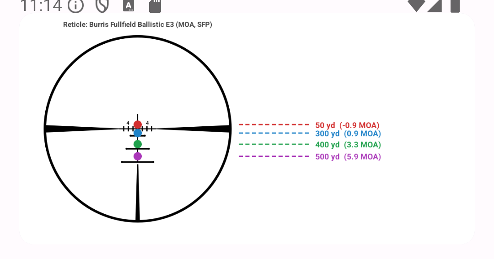 Burris Fullfield Ballistic E3 (MOA, SFP) | MOA | SFP (12×) | Ballistic E3 | Thin vertical (scope top → D=1 MOA stub above center) → thick horizontal bars (±4 MOA gap, ticks at 1/2/3/4 MOA) → BDC marks at 1.49/4.31/7.18 MOA (line widths ±1.5/2.5/3.5 MOA, windage dots ±1.54/2.42/3.38 MOA) → thick bottom post |
| 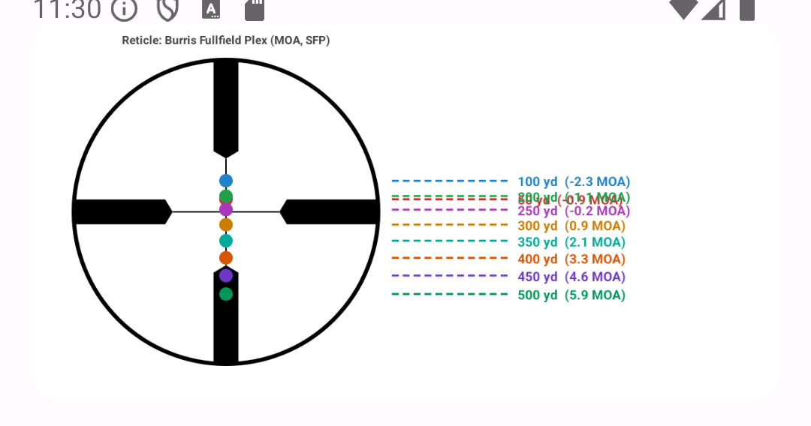 Burris Fullfield Plex (MOA, SFP) | MOA | SFP (8×) | Duplex | Classic duplex: thick tapered posts tapering to short thin center crosshair; gap 0.35 MOA, post half-height 0.93 MOA, extends to ±10.6 MOA. Source: Burris subtension diagram |
| 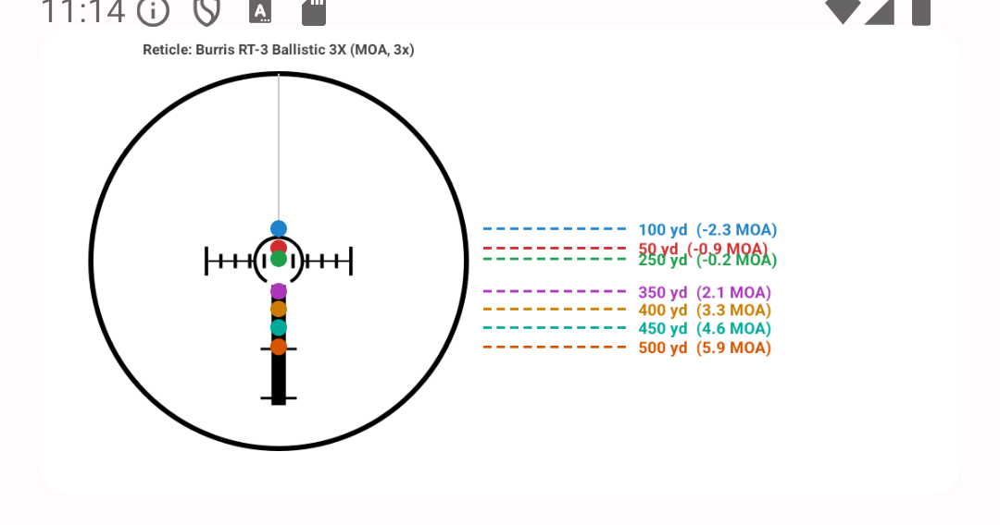 Burris RT-3 Ballistic 3X (MOA, 3x) | MOA | 3× fixed (always accurate) | Ballistic 3X | Broken circle (300° arc, 60° gap at bottom) + center dot; thin BDC post with crossbar ticks at 6.1/9.5 MOA (400/500 yd, both 1.25 MOA half-width); graduated windage arms out to ±5 MOA, ticked every 1 MOA. Circle/dot size measured proportionally from the diagram (not dimensioned in Burris's own table); crossbar depths, half-widths, and post width read directly off the table. Source: burrisoptics.com/reticles/ballistic-3x (model AR-332) |
| 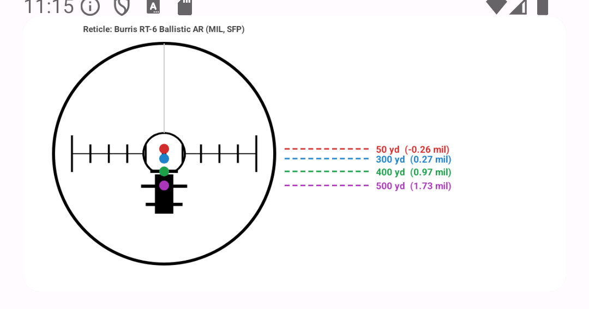 Burris RT-6 Ballistic AR (MIL, SFP) | MIL | SFP (6×) | Ballistic 3X | Same broken-circle + BDC-post + windage-arm family as the RT-3 above, in mils. Circle: 1.125 mil radius, 0.125 mil center dot (both explicitly dimensioned, unlike RT-3's). BDC crossbars at 0.96/1.77/2.76 mil (300/400/500 yd) with per-row half-widths 0.75/1.25/1.0 mil — unlike RT-3 these are *not* uniform. Windage arms out to ±5 mil, ticked every 1 mil. Reticle renamed "Ballistic 5X" on Burris's current site but same design (confirmed via the diagram's own filename, `ballistic-ar-subtensions.png`). Source: burrisoptics.com/reticles/ballistic-5x |
| 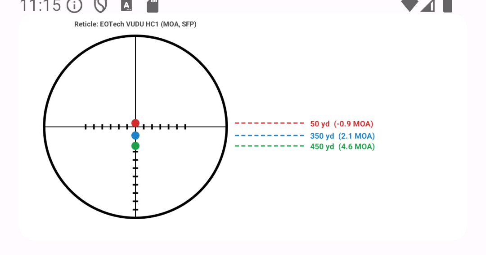 EOTech VUDU HC1 (MOA, SFP) | MOA | SFP (9×) | BDC | Holdover hashes 2–22 MOA in 2 MOA steps; windage ±2–±12 MOA in 2 MOA steps |
| 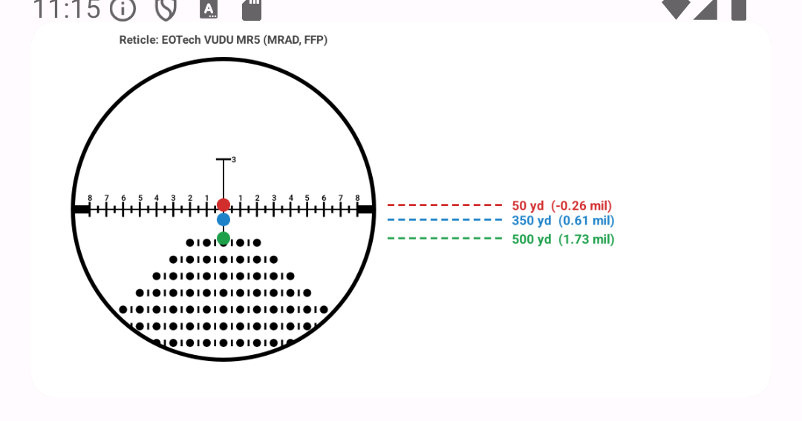 EOTech VUDU MR5 (MRAD, FFP) | MIL | FFP (all mags) | EOTech MR5 tree | Numbered horizontal stadia 2–8 MRAD (thick posts at ±8); short capped top stub to 3 MRAD (no fine ticks); dot-grid Christmas tree rows 2→8 MRAD (starts at row 2, not row 1 — a different convention from the Vortex EBR-7C family). Verified against EOTech's official reticle image (eotechinc.com product SVG), not a manual scan |
| 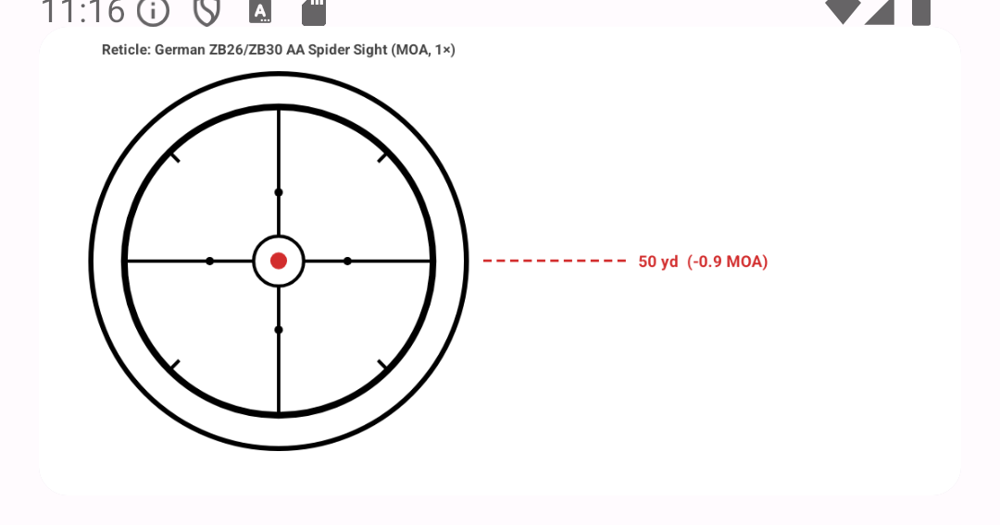 German ZB26/ZB30 AA Spider Sight (MOA, 1×) | MOA | 1× (always accurate) | Spider Sight | Outer ring + 4 crosshair spokes + small center ring + beads on all 4 spokes at ~45% radius + 4 diagonal tick marks at 45° on outer ring. Outer ring ≈ 370 MOA (7.92mm at 775 m/s, 300 km/h aircraft). Values estimated from physics and product photos — source document not located. Source: IMA/Aubrey product photos |
| 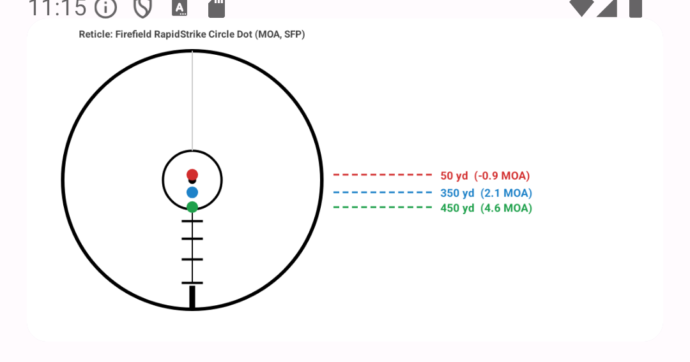 Firefield RapidStrike Circle Dot (MOA, SFP) | MOA | SFP (6×) | Circle BDC | 9.95 MOA circle + 1.34 MOA center dot; thin BDC post 300–600 yd below circle; thick bottom post. Positions estimated — exact MOA not published |
| 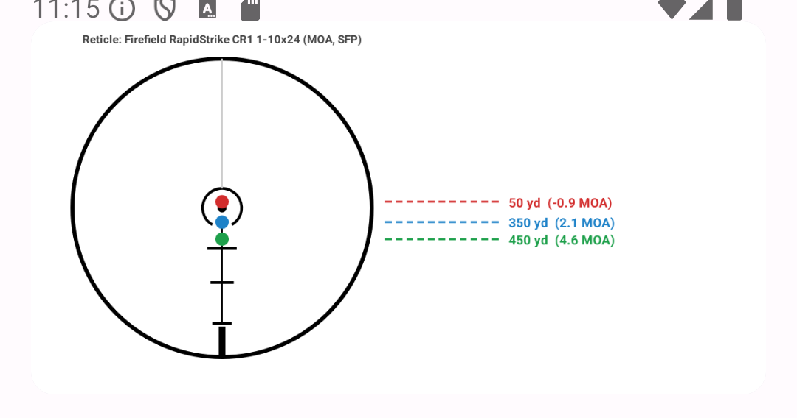 Firefield RapidStrike CR1 1-10x24 (MOA, SFP) | MOA | SFP (10×) | Horseshoe BDC | 5.73 MOA horseshoe arc (300°, 60° gap at bottom; = 18" IPSC target at 300 yd) + 1.34 MOA center dot (0–200 yd); 300-yd holdover at arc gap; hashes at 400/500/600 yd (depths estimated from .223 55gr FMJ ballistics at 100-yd zero). Source: FF13075 user manual pp.14–15 |
| 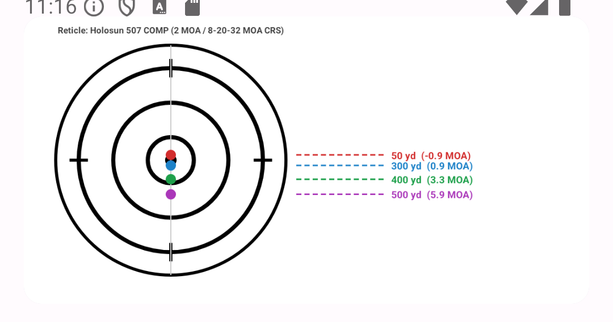 Holosun 507 COMP (2 MOA / 8-20-32 MOA CRS) | MOA | 1× (always accurate) | Circle-dot | Three concentric rings at 8/20/32 MOA + 2 MOA center dot; cardinal tick marks on outermost ring. CRS lets shooter select any single ring or combine all three |
| 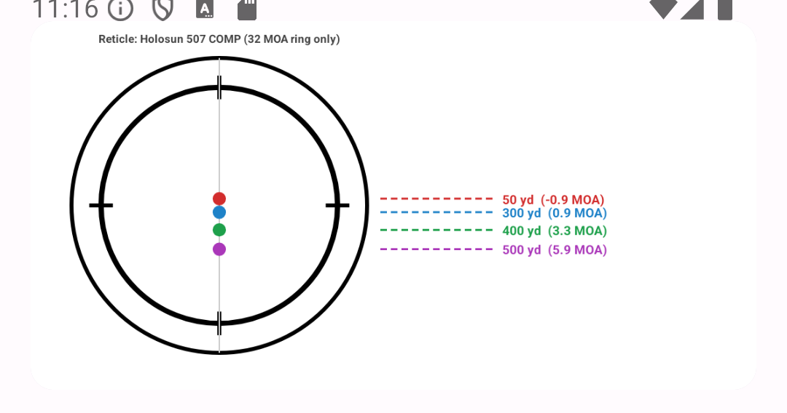 Holosun 507 COMP (32 MOA ring only) | MOA | 1× (always accurate) | Circle-dot | 32 MOA ring only, no center dot; cardinal tick marks at 12/3/6/9 o'clock |
| 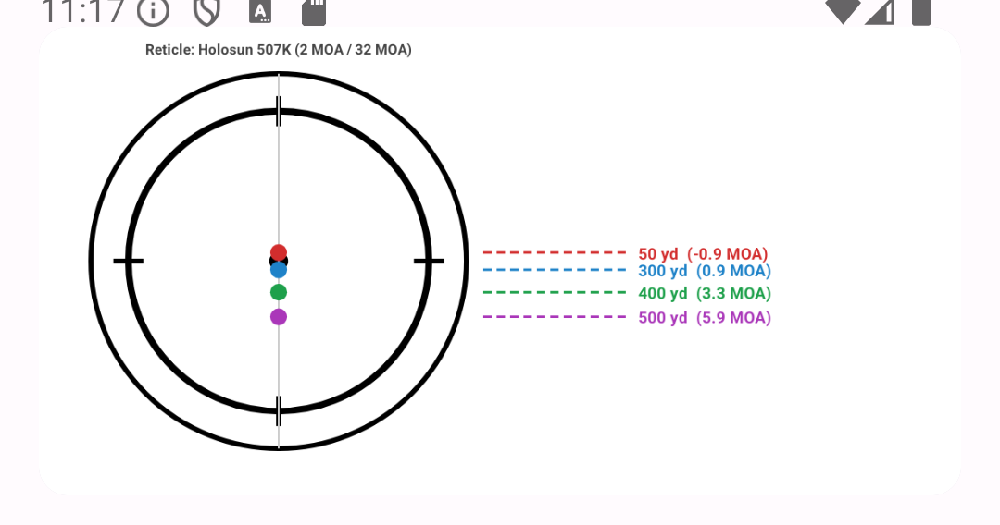 Holosun 507K (2 MOA / 32 MOA) | MOA | 1× (always accurate) | Circle-dot | 32 MOA ring + 2 MOA center dot; cardinal tick marks at 12/3/6/9 o'clock |
| 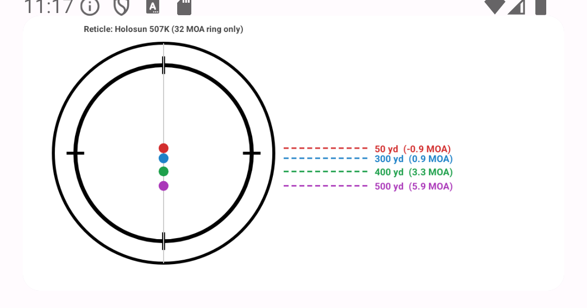 Holosun 507K (32 MOA ring only) | MOA | 1× (always accurate) | Circle-dot | 32 MOA ring only, no center dot; cardinal tick marks at 12/3/6/9 o'clock |
|  Holosun 510C (2 MOA / 65 MOA) | MOA | 1× (always accurate) | Circle-dot | 65 MOA ring + 2 MOA center dot + cardinal tick marks at 12/3/6/9 o'clock |
| 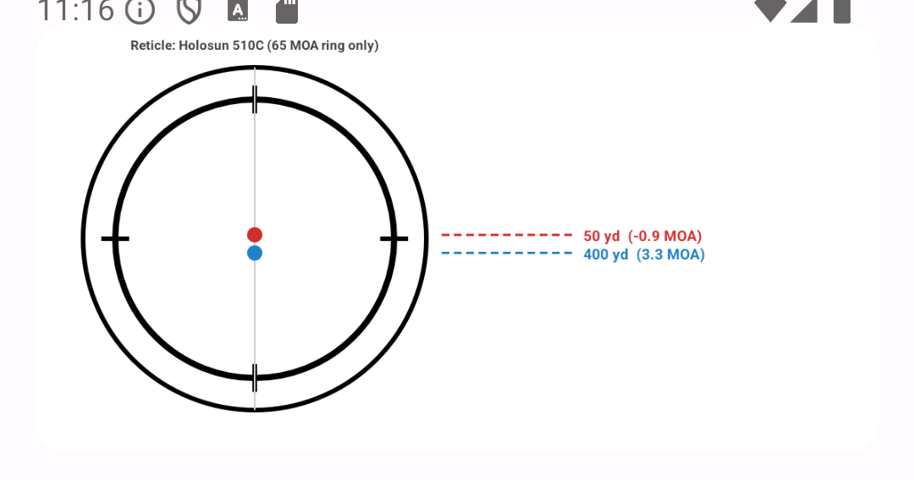 Holosun 510C (65 MOA ring only) | MOA | 1× (always accurate) | Circle-dot | 65 MOA ring only, no center dot; cardinal tick marks at 12/3/6/9 o'clock |
| 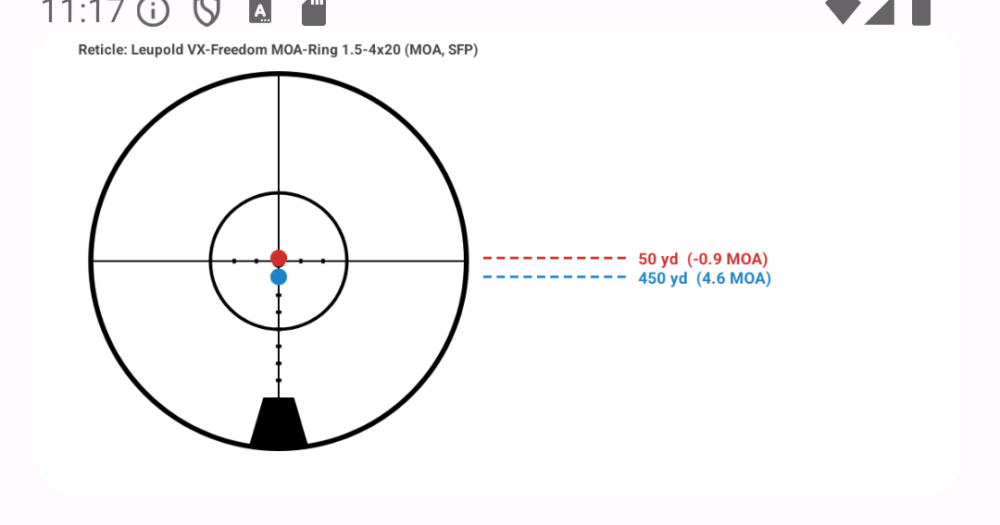 Leupold VX-Freedom MOA-Ring 1.5-4x20 (MOA, SFP) | MOA | SFP (4×) | Ring BDC | 40 MOA ring + 3.4 MOA center circle + full crosshair; lead/windage tick marks at ±6.5 and ±13.0 MOA on H arm; fine BDC ticks at 5 MOA spacing (5–35 MOA); tapered thick post from 40 MOA (4.5 MOA wide) to scope edge (8.9 MOA wide). Source: Leupold MOA-Ring reticle diagram (2021) |
| 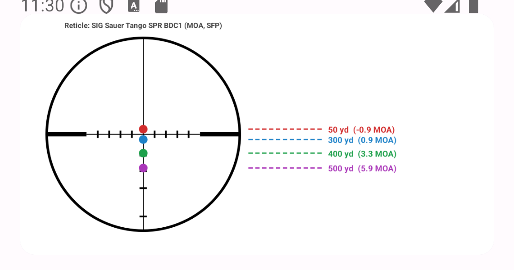 SIG Sauer Tango SPR BDC1 (MOA, SFP) | MOA | SFP (4×) | BDC | Thick H posts at ±10 MOA; holdover marks at 3.75/6.50/9.50/14.50 MOA; thin crosshair with 0.25 MOA ticks. Source: Tango SPR manual p.16 |
| 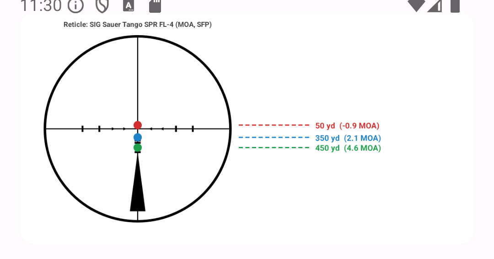 SIG Sauer Tango SPR FL-4 (MOA, SFP) | MOA | SFP (4×) | FL-4 | Thin crosshair with two filled horizontal reference triangles per side at ±3.13/±5.95 MOA, plus plain hashes at ±9.37/±13.48 MOA (9.37 was missing until a 400 DPI re-check of the manual); lower BDC stadia at 2.86/3.44/4.30/5.73 MOA with 0.75 MOA half-widths; lower post to 20.22 MOA with 15° included tip angle. Open outlines in the source diagram are dimensional callouts, not reticle artwork. Source: Tango-SPR manual (25SIG3843_TANGO-SPR_Manual_7405579-01_R11.pdf) p.17 |
| 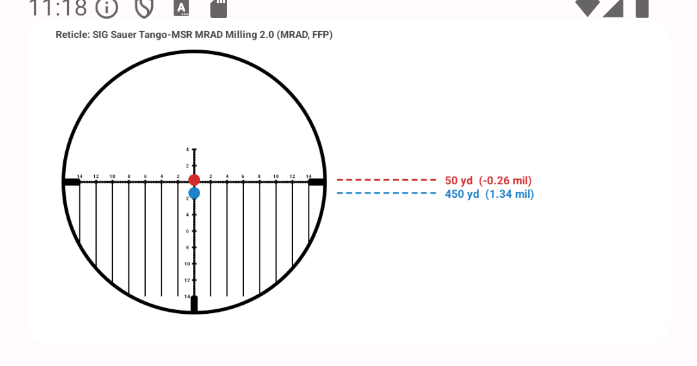 SIG Sauer Tango-MSR MRAD Milling 2.0 (MRAD, FFP) | MIL | FFP (all mags) | SIG MRAD Milling | Fine ladder crosshair: 0.2 MIL minor ticks, numbered every 2 MIL out to ±14; short 4 MIL top post; thin vertical drop-lines hanging from each major windage tick straight down to 14 MIL (no horizontal rungs — not a mesh); thick outer posts beyond ±14 MIL. Dedicated drawing style, verified pixel-by-pixel against the manual diagram. Source: TANGO-MSR Operator's Manual p.28 |
| 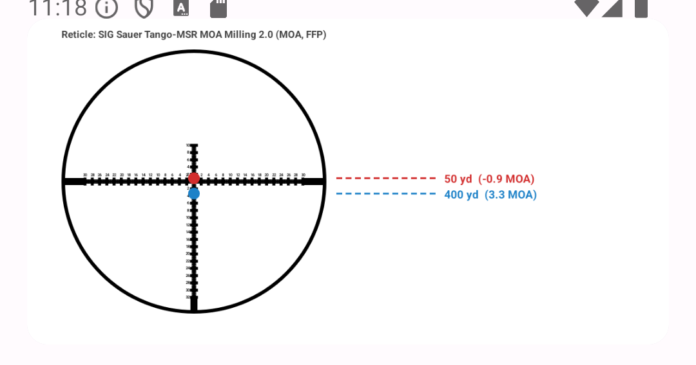 SIG Sauer Tango-MSR MOA Milling 2.0 (MOA, FFP) | MOA | FFP (all mags) | SIG MOA Milling | Plain 4-way ladder/comb crosshair — no drop-lines, distinct design from the MRAD version: 0.5 MOA minor ticks, numbered every 2 MOA out to ±30; short 10 MOA top post, long 32 MOA bottom post (hardcoded from the diagram); thick outer posts beyond ±30 MOA / 32 MOA below center. Source: TANGO-MSR Operator's Manual p.30 |
| 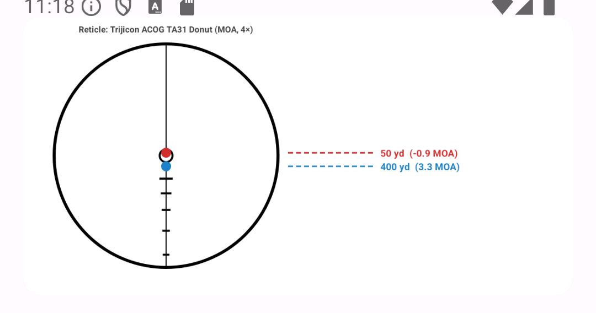 Trijicon ACOG TA31 Donut (MOA, 4×) | MOA | 4× fixed (always accurate) | ACOG Donut | ~2 MOA radius illuminated ring + center dot; top of ring = 100m POA; BDC stadia at 400/500/600/700/800m (widths ±2.08/1.66/1.39/1.19/1.04 MOA for 19" shoulder ranging). Holdover depths from M855 at 100m zero — verify against Trijicon subtension card. Source: ACOG Operator's Manual pp.26–28 |
| 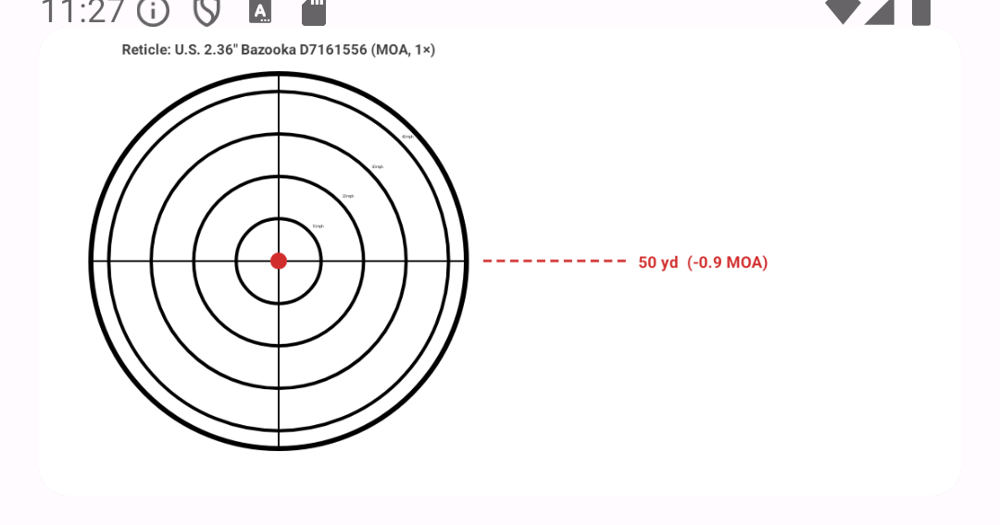 U.S. 2.36" Bazooka D7161556 (MOA, 1×) | MOA | 1× (always accurate) | Lead Rings | Thin crosshair + 4 concentric lead rings at ~190/380/570/760 MOA for 10/20/30/40 mph crossing targets. Ring radii derived from rocket muzzle velocity (265 ft/s): lead_mils = V_mph × 5.536 mils (range-independent). Exact subtensions from TB 9-294-9 not yet confirmed. Source: TM 9-294, SARCO product description |
| 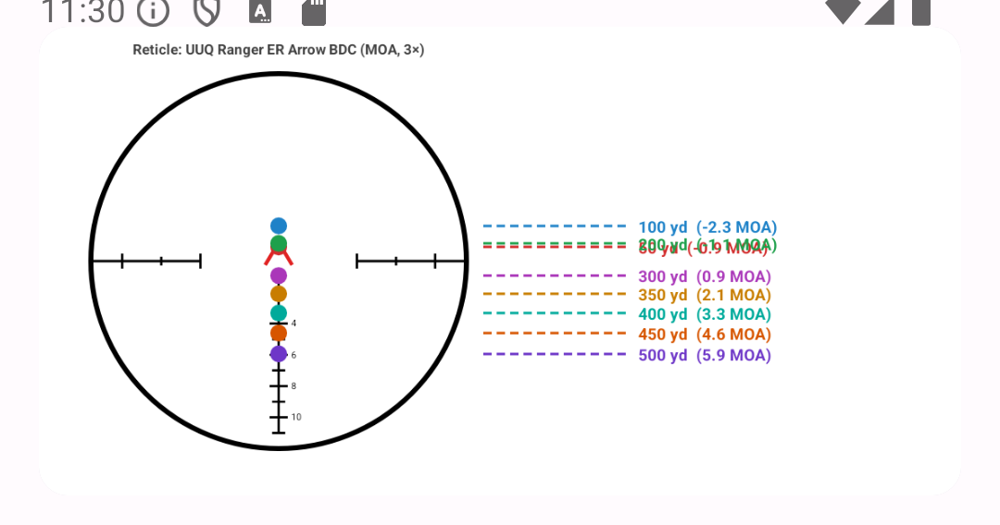 UUQ Ranger ER Arrow BDC (MOA, 3×) | MOA | 3× fixed (always accurate) | Chevron BDC | Upward fiber-optic chevron (∧) at center; separated H arm segments at ±5/7.5/10/13 MOA with I-beam ticks; V post below chevron only with 1 MOA minor ticks labeled at 4/6/8/10 MOA. Calibrated for .22LR/.223/.308 at 100 yd zero. Source: UUQ product page reticle diagram |
| 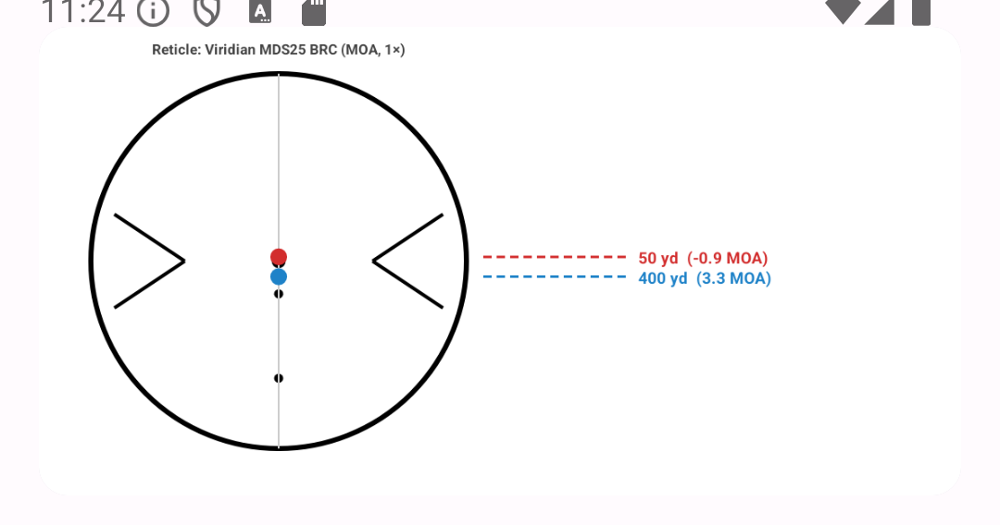 Viridian MDS25 BRC (MOA, 1×) | MOA | 1× (always accurate) | BRC | 3 MOA center dot (50/200 yd); holdunder dots ≈7 MOA (15 yd) and ≈25 MOA (7 yd) below; inward chevrons for ranging. Dot positions estimated — exact MOA not published by Viridian |
| 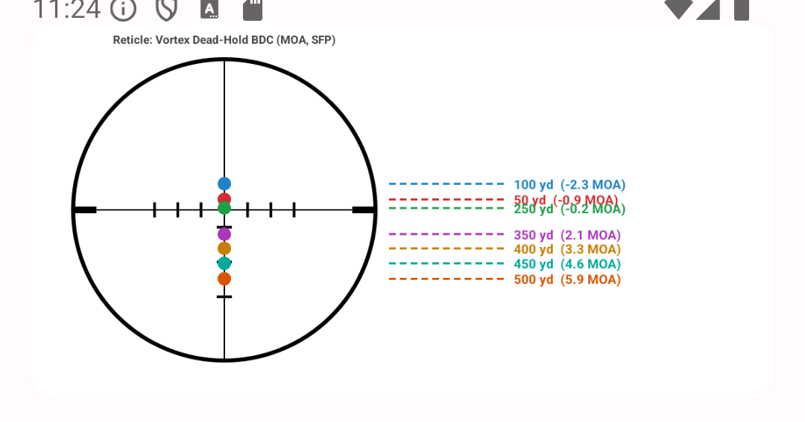 Vortex Dead-Hold BDC (MOA, SFP) | MOA | SFP (max mag) | BDC | Shared across Vortex SFP scopes using this reticle (Viper, 3.5-10×50, Crossfire II 4-12x44, etc. — same physical reticle per Vortex's own scope-model-agnostic manual). Holdover hashmarks: 1.5 / 4.5 / 7.5 MOA; windage ±2 / ±4 / ±6 / ±8 MOA (4th mark added after re-checking the manual's windage diagram); thick outer posts begin at 11 MOA (the post's top edge, not a 4th hashmark). Source: Vortex Dead-Hold BDC MOA reticle manual (M-00240-1) |
| 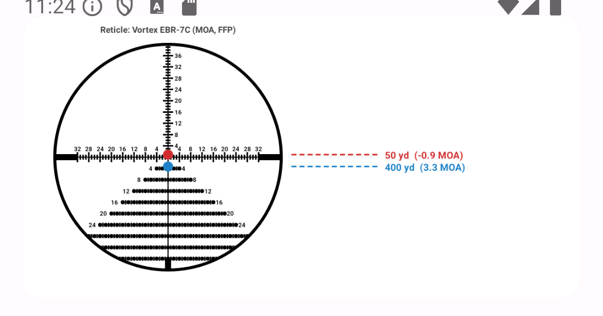 Vortex EBR-7C (MOA, FFP) | MOA | FFP (all mags) | Vortex EBR-7C MOA tree | Numbered H/V stadia (1 MOA minor / 4 MOA major, labeled 4–32), thick posts at ±32 MOA (corrected from an incorrect ±26); dot-grid tree below center rows 4→36 MOA, each row spanning ±row MOA (genuine widening pyramid, re-confirmed against the official manual); thick bottom post. Source: Vortex EBR-7C MOA Reticle Manual M-00247-0. Used in Venom 5-25×56, Viper PST Gen II, Strike Eagle, Razor HD Gen II |
| 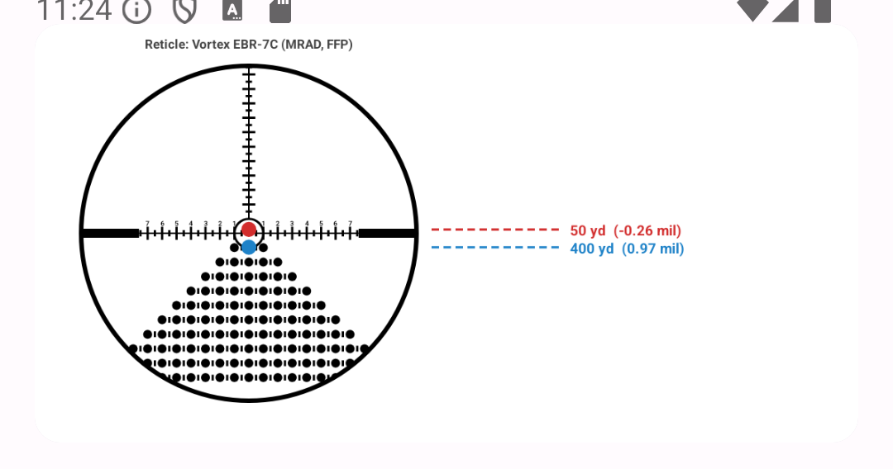 Vortex EBR-7C (MRAD, FFP) | MIL | FFP (all mags) | MRAD tree | Numbered H/V stadia (0.5 MIL minor / 1 MIL major), thick posts at ±7.6 MIL; dot-grid tree below center rows 1→10 MIL. Same reticle family as the MOA version, scaled to mil (26/40 MOA × 0.2909 mil/MOA). Venom 5-25×56 FFP MRAD |
| 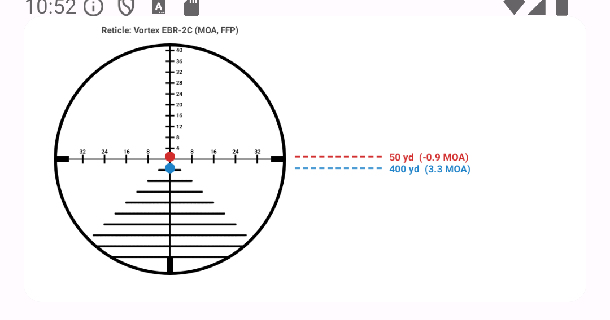 Vortex EBR-2C (MOA, FFP) | MOA | FFP (all mags) | Vortex EBR-2C MOA tree | Genuinely different design from EBR-7C, not just a rescale: open center (.25 MOA gap), fine dot-grid tree (0.3 MOA dot pitch) rows every 4 MOA to 36 MOA, horizontal numbered ticks at 2x the vertical spacing (every 8 MOA vs every 4 MOA), thick posts on left/right/bottom only (no top post). Diamondback Tactical 4-16x44 FFP. Source: Vortex EBR-2C MOA reticle manual (M-00209-1) |
| 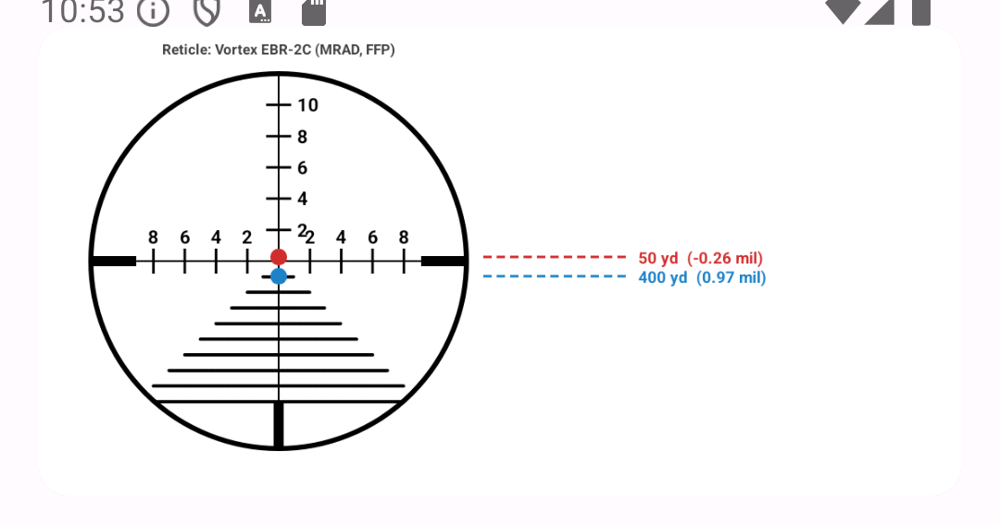 Vortex EBR-2C (MRAD, FFP) | MIL | FFP (all mags) | Vortex EBR-2C MRAD tree | Same family as the MOA version above with its own asymmetry: dot-tree rows every 1 mil (twice as dense as the numbered ticks, which are every 2 mil on both axes here — unlike the MOA version's 2x horizontal spacing). Open center .06 mil gap; dot pitch .075 mil; thick posts left/right/bottom only at 9.1 mil. Diamondback Tactical 4-16x44 FFP. Source: Vortex EBR-2C MRAD reticle manual (M-00210-0) |
| 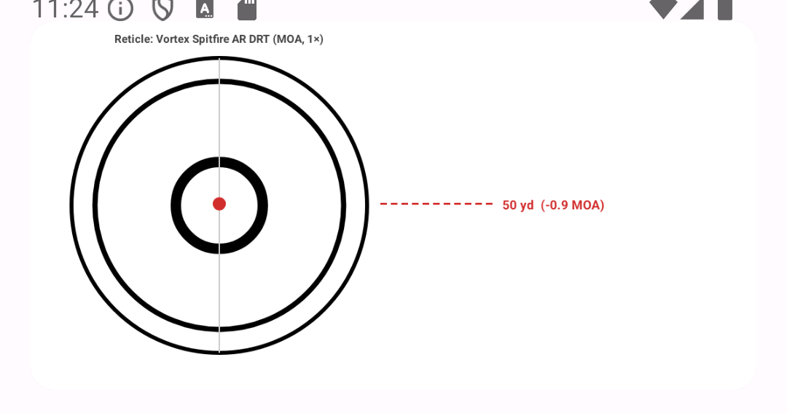 Vortex Spitfire AR DRT (MOA, 1×) | MOA | 1× (always accurate) | DRT | 3 MOA center dot; inner ring 44 MOA ID / 6 MOA thick; outer ring 140 MOA ID / 3 MOA thick |
| 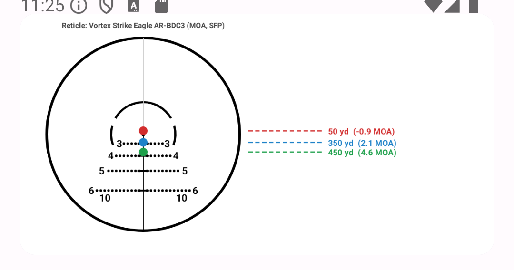 Vortex Strike Eagle AR-BDC3 (MOA, SFP) | MOA | SFP (8×) | AR-BDC3 | Horseshoe (large top arc + side hooks, open bottom) + 1 MOA center dot; BDC post at 2.4/5.6/9.5/14.6 MOA (300–600 yd); windage dot rows widening at 1 MOA steps to ±5/7/10/12 MOA; "3"–"6" range labels and "10" mph wind label at 600 yd |
| 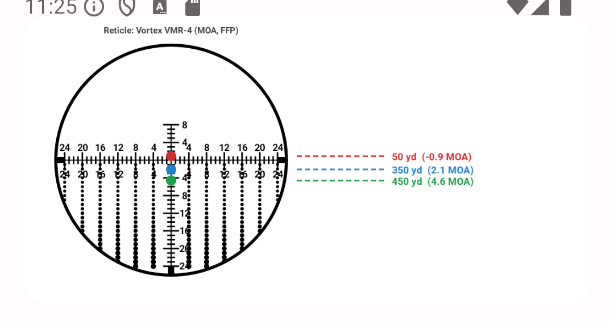 Vortex VMR-4 (MOA, FFP) | MOA | FFP (all mags) | Vortex VMR-4 ladder | CORRECTED (was previously a dot-grid tree, an incorrect assumption carried over from the EBR-7C preset). Real design: ladder crosshair numbered 4–24 MOA (thick posts at ±24) with dotted windage drop-lines hanging from each major tick, dots growing with distance. Top arm (8 MOA) is an estimate. Source: Vortex Reticle Manual M-00358-0, pp.2-3. Viper HD 5-25×50 FFP |
| 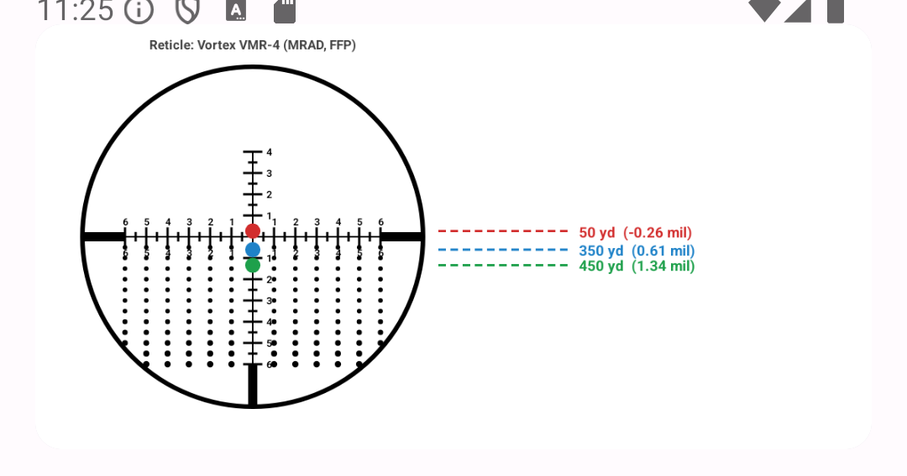 Vortex VMR-4 (MRAD, FFP) | MIL | FFP (all mags) | Vortex VMR-4 ladder | Same corrected design as the MOA version: ladder crosshair numbered 1–6 MRAD (thick posts at ±6) with dotted windage drop-lines. Top arm (4 MRAD) is an estimate. Source: Vortex Reticle Manual M-00359-0, pp.2-3. Viper HD 5-25×50 FFP |

**Drag model** — G1 or G7. The BC value you enter must reference the model you
pick. Manufacturers usually publish G1; many also publish G7 for long
boat-tail bullets where G7 fits better. Don't convert between them with a
fixed multiplier; use the manufacturer's value.

**Bullet & sight** — muzzle velocity (fps), BC, sight height above bore (in),
vital zone diameter (in). Muzzle velocity must be at least 400 fps — below
that the point-blank-range model's flat-fire assumption breaks down (the
bullet decelerates below its own drag-limited terminal fall speed before it
gets anywhere, so "velocity" can start climbing back up with range instead
of decaying, and drop/holdover values blow up to thousands of MOA well
inside a normal table). Even the slowest cataloged subsonic loads run
700+ fps, so 400 fps rejects only physically unrealistic inputs.

**Atmosphere** — altitude (ft), temperature (°F), humidity (%), wind speed
(mph full-value crosswind). Defaults are Parma, ID conditions (2231 ft, 70°F,
25% RH, 0 mph). Set wind to 0 to hide the drift columns in the trajectory
table.

**Trajectory Table** — configurable start, step, and end range (defaults
0 / 50 / 500 yd; start 0–2000, step 1–500, end 0–2000). Both on-screen
table and DOPE chart use these values. Start must be less than end. Start,
step, and end accept whole numbers only.

**Target Distance** — optional single-range lookup. Check the box and enter
a distance (any whole number, not limited to the table step interval) to see
drop, holdover MOA/MIL, velocity, and energy at that exact range in the
Results card (interpolated from the high-resolution trajectory). When a
reticle is selected and results are shown, a second checkbox appears —
**Show target distance only on reticle** — which hides all other range
callouts on the reticle illustration and displays only the target distance
dot. This is useful for previewing the exact hold point for a known distance
regardless of how coarse the table step is.

**Metric toggle** — the **Not Metric / Metric** chip on the right side of
the Drag Model row toggles SI units. When active the label reads "Metric";
when inactive it reads "Not Metric". Inputs show m/s, mm, cm, m, °C, km/h;
results and trajectory table show m, cm, m/s, J; DOPE chart exports in
metric too. Internal calculations always use imperial — sessions save and
load in imperial regardless of the toggle. Bullet weight stays in grains
(universal in the ammunition world). BC is dimensionless. Angular values
(MOA, MIL) are unit-system-independent and never change.

**DOPE Card Title** — editable heading printed at the top of the saved JPEG
(default "MPBR DOPE CARD"). Leave blank to keep the default.

**Notes / Turret Adjustments** — multiline free-text field below the title.
Appears as a "Notes:" section at the bottom of both the saved JPEG and the
printed DOPE chart, after the trajectory table. Use it for turret click
settings, zero-distance notes, or any range card annotation. Saved and
restored with sessions.

**Sessions** — tap the 💾 (Save) icon in the title bar to save the current
setup (all inputs: ammo, reticle, atmosphere, table range, DOPE title, notes) under
a name. The name pre-fills as `"<Preset> — MM/dd"` and can be edited. Saving
with an existing name overwrites it. Tap the 📂 (Load) icon to open the
sessions list — tap a name to restore all inputs and auto-calculate, tap ✕
to delete a session. Sessions persist across app restarts (stored in
SharedPreferences).

## Algorithm

1. Bisect bore angle until trajectory peak above LOS equals exactly
   `vital_zone / 2`.
2. Re-simulate at high resolution and read off:
   - **Near zero** — first LOS crossing (rising)
   - **Far zero** — second LOS crossing (falling); optimal sight-in distance
   - **Max ordinate** — peak height and its range
   - **MPBR** — range where bullet drops to `-vital_zone / 2`
   - **Bore angle** — informational, barrel angle above LOS

Drag uses standard G1/G7 Cd vs Mach tables with linear interpolation. Air
density and speed of sound scale from ICAO sea-level standards using the
ICAO troposphere pressure model, temperature, and humidity (Magnus saturation
+ standard `1 − 0.378·Pᵥ/P` correction). Crosswind enters as a lateral
air-relative velocity component so it naturally affects drag magnitude and
produces lateral drift. No spin drift, no Coriolis.

## Results layout

After calculating, the results screen shows (in order):

1. Summary card — near/far zero, MPBR, max ordinate, bore angle, velocity/energy;
   if Target Distance is enabled, also shows drop, holdover, velocity, and energy
   at that exact range
2. **Reticle illustration** (if a reticle is selected) — live on-screen scope view
   with color-coded holdover callout dots and labels for each range in the table;
   when **Show target distance only on reticle** is checked, only the target
   distance callout is shown
3. Trajectory table — holdover/drift/velocity/energy for each range in the configured
   start-to-end window

## Saving a DOPE chart

After calculating, tap **Save DOPE Chart** or **Print DOPE Chart** (appear below
the trajectory table). **Save** renders a 1200 px JPEG and writes it to
**Pictures/MPBR DOPE Charts/** in your gallery (on Android 8 or earlier the app
will ask for storage permission the first time). **Print** sends the same image
to the system print dialog (AirPrint, PDF, etc.). Both render:

- Load name, near/far zero, MPBR, max ordinate, bore angle
- Altitude, temperature, humidity, wind conditions
- **Reticle illustration** (if a reticle is selected) — a scope circle showing
  the reticle's crosshair and marks. Each trajectory range gets a unique color:
  a filled dot placed at the bullet's actual 2D position on the reticle
  (elevation + crosswind drift), a dashed leader line, and a bold
  "250 yd (2.3 MOA)" label. Labels that would overlap are skipped; points
  outside the reticle's extent are omitted. FFP reticles work at any
  magnification; SFP values are valid at maximum magnification only.
- Full trajectory table at 50 yd steps over the configured range (same columns
  as on-screen — drift columns appear only when wind ≠ 0, energy only when bullet
  weight is set; the redundant MOA or MIL column is dropped when a reticle is
  selected)
- **Notes section** (if the Notes field is non-empty) — rendered at the bottom
  after the trajectory table; each newline in the field becomes a separate line
- Date of generation

## Easter eggs

Tap the **Ammunition** section label five times quickly to play a synthesized gunshot sound.

## Things to add next

- Frickin Laser Beams.

## Code quality

All Android Studio warnings resolved as of v1.27:
- KTX functions used throughout (`createBitmap`, `withClip`)
- Kotlin stdlib used for math (`roundToInt`, `abs`, `floor`)
- No unused parameters, no shadowed lambdas, all locals lowercase
- `MPBR`, `reticle`, `holdunder`, `Traj`, and date-format tokens added to
  the project spellcheck dictionary (`.idea/dictionaries/project.xml`)
